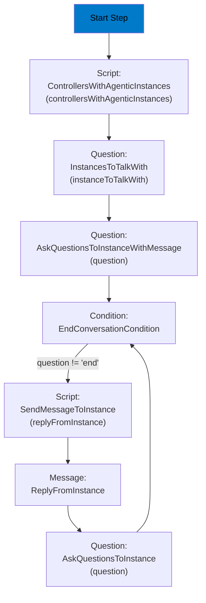

# Business Scenario Agentic Chat

## Scenario - Diagram

```mermaid
graph TD
classDef startClass fill: #007ac9, color:#000000;
classDef finallyClass fill: #50b450, color:#000000;
classDef endClass fill: #3b8b3b, color:#000000;
    ControllersWithAgenticInstances["Script:
ControllersWithAgenticInstances
(controllersWithAgenticInstances)"] --> InstancesToTalkWith
    InstancesToTalkWith["Question:
InstancesToTalkWith
(instanceToTalkWith)"] --> AskQuestionsToInstanceWithMessage
    AskQuestionsToInstanceWithMessage["Question:
AskQuestionsToInstanceWithMessage
(question)"] --> EndConversationCondition
    EndConversationCondition["Condition:
EndConversationCondition"] -->
|"question != 'end'"|SendMessageToInstance
    SendMessageToInstance["Script:
SendMessageToInstance
(replyFromInstance)"] --> ReplyFromInstance
    ReplyFromInstance["Message:
ReplyFromInstance"] --> AskQuestionsToInstance
    AskQuestionsToInstance["Question:
AskQuestionsToInstance
(question)"] --> EndConversationCondition
    StartStep["Start Step"]:::startClass  --> ControllersWithAgenticInstances
```
